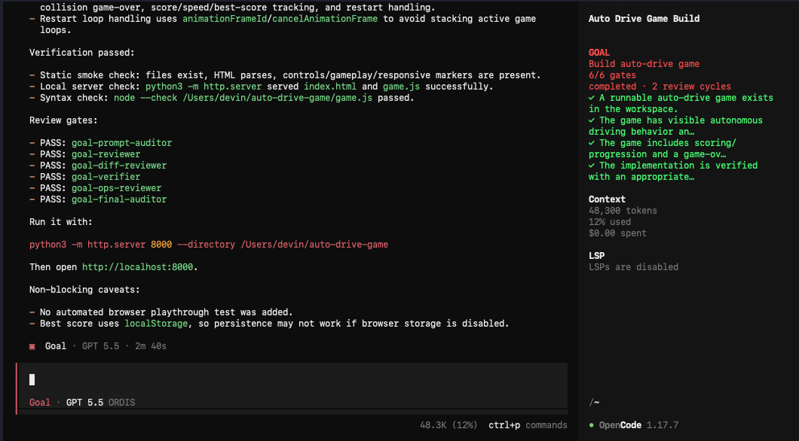

<div align="center">
  
# OpenCode Goal Mode

### The OpenCode agent that can't fake "done" — and can't wreck your repo doing it.

Give it a goal. It writes a contract, does the work, reviews itself with a fleet of
specialist subagents, and **physically cannot tell you it's finished until those reviews
actually pass**. Reach for `rm -rf` mid-run and it stops the command cold.

[](https://www.npmjs.com/package/opencode-goal-mode)
[](https://www.npmjs.com/package/opencode-goal-mode)
[](https://github.com/devinoldenburg/opencode-goal-mode/actions/workflows/ci.yml)
[](https://github.com/devinoldenburg/opencode-goal-mode/actions/workflows/publish.yml)
[](LICENSE)

```bash
npm install -g opencode-goal-mode
```

</div>

Every coding agent will happily announce "✅ Done!" over a half-finished feature and a
red test suite. Goal Mode ends that. It moves the discipline out of the prompt — where a
confident model just talks past it — and into the **harness**, where it's enforced in
code. The agent's "Goal Completed" is intercepted and rewritten to "Goal Not Completed"
unless every required review gate has a *fresh* pass. Dangerous shell commands are
blocked before they ever execute.

It's the difference between *asking* an agent to be careful and *making* it.

## Watch it refuse to lie

The agent tries to declare victory early. The guard catches it and hands back the truth:

```diff
- Goal Completed
+ Goal Not Completed
+
+ Goal Guard blocked completion: required review gates are missing or stale
+ (goal-security-reviewer, goal-final-auditor). State: active=true; dirty=true;
+ reviewCycles=1; missingGates=goal-security-reviewer goal-final-auditor
```

The agent reaches for something irreversible. The guard kills it before it runs:

```text
$ rm -rf build
✕ Goal Guard blocked a destructive or high-risk bash command
  (rm with recursive force deletion). Use a safer, reversible command
  or ask the user to confirm.
```



<sub>↑ While a goal runs, Goal Mode takes over the TUI sidebar with a live, evidence-aware
todo list: the goal title, gate progress, and a row per acceptance criterion and missing
reviewer — each ticking off as the work gets verified.</sub>

## Why you'll want it

🔒 **"Done" actually means done.** Completion is gated on real review verdicts, not vibes.
The model can't answer `Goal Completed` until every required reviewer returns
`Verdict: PASS` *after* the last edit — and the claimed `Review cycles: N` has to match
the counter the guard kept.

🤖 **The reviews run themselves.** When the agent stops with work outstanding, the guard
*launches the reviewer subagents itself* — security, diff, verification, and more — reads
their verdicts, and loops fix → review until they pass. You never rely on the model to
remember to check its own work.

♻️ **One edit reopens the gates.** Approvals are stamped with a monotonic sequence, so any
change after a review instantly goes stale and forces the relevant reviews to re-run.
There's no sneaking a "fix" in after the green light.

🧠 **It knows which experts to call.** Touch auth and the security reviewer becomes
mandatory. Touch a migration and the data reviewer joins. API, performance, tests, UX,
ops, docs, quality — the right specialist gates are required automatically from your goal
and your diff.

🛡️ **Your repo survives.** A real shell tokenizer — not a brittle regex — blocks the
destructive stuff even when it's disguised: `$(rm -rf …)`, `bash -c "…"`, `/bin/rm`,
`busybox rm -rf`, `git reset --hard`, `curl | sh`. Harmless look-alikes like
`git checkout -b` sail right through.

🚀 **It doesn't quit on you.** An idle-but-unfinished goal gets automatically pushed
forward — told exactly what's left — until it's genuinely complete, with hard caps and a
no-progress breaker so it can never spin.

## The numbers

Tested on **704 real-world commands** from [tldr-pages](https://github.com/tldr-pages/tldr)
(common/linux/osx) — commands written by hundreds of contributors who've never seen this
guard:

| On 704 commands it has never seen | Regex guard | **Goal Mode** |
| --- | :---: | :---: |
| Dangerous commands caught | 53.8% | **93.3%** |
| Safe commands wrongly blocked | 0.2% | **0.2%** |


And it's effectively free: **~1µs per command**, hundreds of thousands of classifications
a second. Run it yourself with `npm run bench`.


## How it stacks up

| | **Goal Mode** | Claude Code | Codex |
| --- | :---: | :---: | :---: |
| Blocks a premature "done" out of the box | **Yes** | Only via a custom hook | Review is advisory |
| Edits auto-invalidate stale approvals | **Yes** | — | — |
| Specialist reviews auto-required from the task | **Yes** | — | — |
| Destructive commands blocked by a real shell parser | **Yes** | Regex ("fragile") | Sandbox |


Full side-by-side with citations: [research/goal-mode-comparison.md](research/goal-mode-comparison.md).

## Install

One command. Needs [Node](https://nodejs.org) 20.11+ and [OpenCode](https://opencode.ai).
macOS and Linux:

```bash
npm install -g opencode-goal-mode
```

Then **restart OpenCode**. Global installs auto-run the installer via
`postinstall`; re-run `opencode-goal-mode --global` if auto-setup fails or you
need `--force`. The installer drops the Goal agent, its reviewer subagents, slash
commands, and the guard plugin into `~/.config/opencode`, and registers the live
sidebar in `tui.json`. In the agent picker you'll see just **`goal`** — the
reviewers are subagents it drives for you. It's idempotent (re-run to upgrade),
never overwrites agents/commands/plugins you've edited (but merge-adds the
sidebar entry in `tui.json`), and `--uninstall` removes exactly what it added.
Goal Mode uses whatever model and provider OpenCode is already set up with.

<details>
<summary>Other ways to install</summary>

```bash
# Preview first — no writes on --dry-run
opencode-goal-mode --global --dry-run

# One-off with npx (no global package needed)
npx opencode-goal-mode --global

# Into a single project (writes ./.opencode)
npx opencode-goal-mode

# Remove everything it installed
opencode-goal-mode --global --uninstall

# From source
git clone https://github.com/devinoldenburg/opencode-goal-mode
cd opencode-goal-mode && npm ci && npm run install:global
```

`--global` writes to `~/.config/opencode`; no flag writes to `./.opencode`; `--target`
writes to the directory you pass. On upgrade it replaces files it owns but refuses to
clobber files you've modified unless `--force` is passed.
</details>

## Quick start

```bash
# After installing + restarting OpenCode, confirm it loaded — you'll see ONLY
# `goal (primary)`, with every specialist as a (subagent):
opencode agent list | grep goal
```

Then, in OpenCode, just give it a goal:

```
/goal add rate limiting to the login endpoint and prove it works
```

It writes a contract, delegates research to subagents, implements, and verifies — then
stops and lets the guard run the reviews. It won't say `Goal Completed` until they pass.
Want to feel the seatbelt? Ask it to `rm -rf build` mid-session and watch the guard slap
it down.

See [ARCHITECTURE.md](ARCHITECTURE.md) for the full design and [research/](research/) for
the platform reference, comparison, and threat model.

## Configure it (or don't)

Goal Mode works great with zero configuration. When you want to tune it, set options in
`opencode.json` or `GOAL_GUARD_*` environment variables:

```jsonc
{
  "plugin": [
    ["./plugins/goal-guard.js", { "blockDestructive": true, "contextualGates": true }]
  ]
}
```

| Option / env | Default | Effect |
| --- | --- | --- |
| `blockDestructive` / `GOAL_GUARD_BLOCK_DESTRUCTIVE` | `true` | Block destructive bash before execution. |
| `blockNetworkExec` / `GOAL_GUARD_BLOCK_NETWORK_EXEC` | `true` | Block `curl \| sh`-style remote execution. |
| `enforceCompletion` / `GOAL_GUARD_ENFORCE_COMPLETION` | `true` | Rewrite premature `Goal Completed`. |
| `autoContinue` / `GOAL_GUARD_AUTO_CONTINUE` | `true` | Auto-continue an idle goal that isn't complete yet. |
| `maxAutoContinue` / `GOAL_GUARD_MAX_AUTO_CONTINUE` | `50` | Hard cap on automatic continuations per goal session. |
| `programmaticReview` / `GOAL_GUARD_PROGRAMMATIC_REVIEW` | `true` | Have the guard launch the required reviewers itself on idle (as subtasks on the goal session). |
| `reviewTimeoutMs` / `GOAL_GUARD_REVIEW_TIMEOUT_MS` | `360000` | Per-reviewer wall-clock cap (ms) for a programmatic review. |
| `reviewPollMs` / `GOAL_GUARD_REVIEW_POLL_MS` | `2500` | Poll cadence (ms) while waiting for a reviewer's verdict. |
| `reviewIdleDeferMs` / `GOAL_GUARD_REVIEW_IDLE_DEFER_MS` | `1500` | Delay (ms) after idle before launching reviewers; also backs off on `SessionBusy`. |
| `reviewIdleRetryMs` / `GOAL_GUARD_REVIEW_IDLE_RETRY_MS` | `2500` | Backoff (ms) between automatic retries when the host is still busy after idle. |
| `maxReviewIdleRetries` / `GOAL_GUARD_MAX_REVIEW_IDLE_RETRIES` | `10` | Max automatic idle-review retries before pausing for manual review. |
| `maxReviewCycles` / `GOAL_GUARD_MAX_REVIEW_CYCLES` | `12` | Hard cap on programmatic review runs per goal; on reaching it the guard pauses for you. |
| `abortGraceMs` / `GOAL_GUARD_ABORT_GRACE_MS` | `1200` | Grace (ms) before an idle goal auto-continues, so a user cancel is always honored. |
| `injectSystemState` / `GOAL_GUARD_INJECT_SYSTEM_STATE` | `true` | Inject live guard state into the prompt. |
| `persist` / `GOAL_GUARD_PERSIST` | `true` | Persist state under the XDG state dir. |
| `contextualGates` / `GOAL_GUARD_CONTEXTUAL_GATES` | `true` | Require specialist gates by goal keywords. |
| `restrictSubagents` / `GOAL_GUARD_RESTRICT_SUBAGENTS` | `true` | Lock the `goal-*` subagents to the Goal agent. |
| `maxSessions` / `GOAL_GUARD_MAX_SESSIONS` | `200` | Session cache size. |
| `sessionTtlMs` / `GOAL_GUARD_SESSION_TTL_MS` | `86400000` | Idle session TTL. |
| `toastOnBlock` / `GOAL_GUARD_TOAST_ON_BLOCK` | `true` | Toast when something is blocked. |
| `toastOnReview` / `GOAL_GUARD_TOAST_ON_REVIEW` | `true` | Toast on each review verdict and when completion unlocks. |
| `sidebarBanner` / `GOAL_GUARD_SIDEBAR_BANNER` | `true` | Show the live Goal todo section in the TUI sidebar. |
| `sidebarColor` / `GOAL_GUARD_SIDEBAR_COLOR` | `#FFD700` | Colour of the GOAL label for a **running** goal. |
| `sidebarDoneColor` / `GOAL_GUARD_SIDEBAR_DONE_COLOR` | `#FF5555` | Colour of a **done** goal in the sidebar. |
| `sidebarMutedColor` / `GOAL_GUARD_SIDEBAR_MUTED_COLOR` | `#808080` | Foreground colour for **pending** Goal todo rows (□ items) while a goal is running. |
| `completionMarker` / `GOAL_GUARD_COMPLETION_MARKER` | `Goal Completed` | Phrase that, at the start of a message, claims completion. |
| `blockedMarker` / `GOAL_GUARD_BLOCKED_MARKER` | `Goal Not Completed` | Replacement written when a completion claim is blocked. |

**Slash commands:** `/goal`, `/goal-contract`, `/goal-review`, `/goal-evidence-map`,
`/goal-status`, `/goal-repair`, `/goal-final`.

**Tools the model can call:** `goal_contract`, `goal_evidence`, `goal_evidence_map`,
`goal_reviewer_memory`, `goal_status`, `goal_reset`.

## Troubleshooting

- **`opencode agent list` doesn't show `goal`?** The agents didn't land where OpenCode
  reads them — re-run `opencode-goal-mode --global` and restart OpenCode.
- **No sidebar todo section?** TUI plugins load from `tui.json`, not `plugins/`. Confirm
  `~/.config/opencode/tui.json` lists `opencode-goal-mode`, then fully restart OpenCode.
  The sidebar is experimental and only shows inside a Goal session with a goal set;
  enforcement works regardless of the sidebar.
- **Reviews didn't kick off on their own?** Upgrade to **v0.6.9+**. After you stop
  with work done, the guard automatically retries if the session is still busy —
  you should **not** need to type "continue?". Reviewer subtasks appear on the goal
  session and the guard starts the next assistant turn with fixes or completion.
- **Explorer subagent prompting on basic shell?** Upgrade to v0.6.7+ — read-only
  commands like `grep`, `cat`, and `sed` are pre-approved on `goal-explorer`.
- **Goal agent stalling on Questions?** The primary `goal` agent has `question: deny`
  (v0.6.7+); record assumptions in the Goal Contract instead.
- **A safe command got blocked?** Run `node benchmarks/external.mjs --json` to see how the
  analyzer reads it, set `blockDestructive: false` for that project, and please
  [open an issue](https://github.com/devinoldenburg/opencode-goal-mode/issues).

## Good to know

- **Requirements:** Node 20.11+, OpenCode configured to load local agents/commands/
  plugins (tested against `@opencode-ai/plugin` 1.17.6, compatible with the 1.15+ hook
  surface), and a working provider/model. Agents inherit your OpenCode default model.
- **Safety:** The installer copies `agents/*.md`, `commands/*.md`, and `plugins/`,
  merge-registers the sidebar in `tui.json`, and writes a manifest — never auth
  files, tokens, or provider config. The guard is a guardrail, not a sandbox,
  and fails open on input it can't parse; see [SECURITY.md](SECURITY.md) for the threat
  model and a private reporting channel.

## Contributing

PRs welcome — [CONTRIBUTING.md](CONTRIBUTING.md) has the dev loop and release process,
and [CHANGELOG.md](CHANGELOG.md) has the full history. Releases are automated and
version-synced: one pushed `vX.Y.Z` tag runs the CI gate, publishes to npm, and creates
the matching GitHub Release.

## License

[MIT](LICENSE) · built for [OpenCode](https://opencode.ai).
