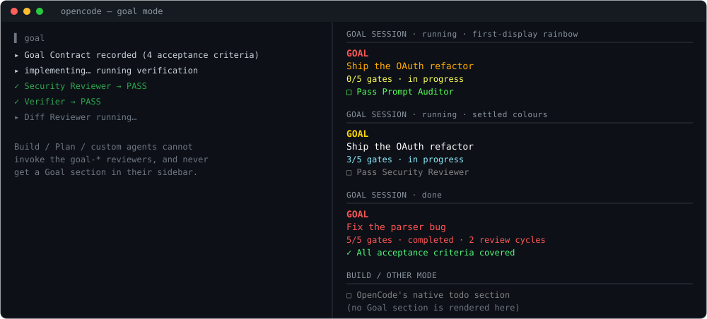
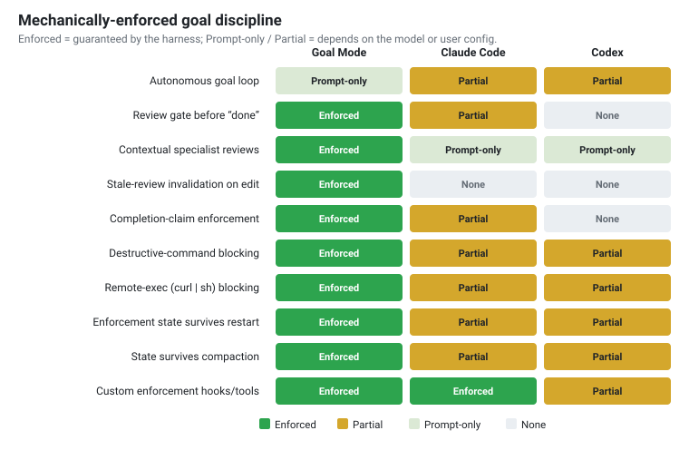
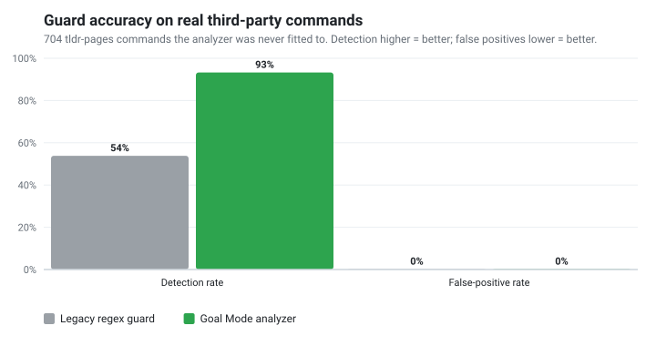
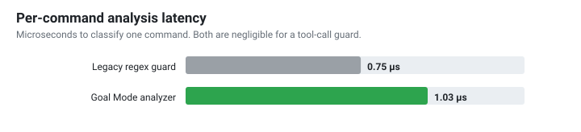

# OpenCode Goal Mode

[](https://www.npmjs.com/package/opencode-goal-mode)
[](https://www.npmjs.com/package/opencode-goal-mode)
[](https://github.com/devinoldenburg/opencode-goal-mode/actions/workflows/ci.yml)
[](https://github.com/devinoldenburg/opencode-goal-mode/actions/workflows/publish.yml)
[](LICENSE)
[](package.json)

Strict Goal Mode for OpenCode: a primary `goal` agent, specialized review
subagents, slash commands, a `goal-guard` plugin that enforces review discipline
and blocks destructive shell commands, and a live Goal-owned todo section in the
TUI sidebar.

## Install

**One command** (recommended; needs [Node](https://nodejs.org) 20.11+ and a working [OpenCode](https://opencode.ai) install):

```bash
npx opencode-goal-mode --global
```

Then **restart OpenCode**. That's the whole install: it copies the Goal agent,
review subagents, slash commands, and guard plugin into `~/.config/opencode`, and
merge-safely registers the Goal todo sidebar in `~/.config/opencode/tui.json`.
In the agent picker you'll see only the **`goal`** agent; reviewers are subagents
it drives automatically. Goal Mode inherits your existing OpenCode model/provider.

<details>
<summary>Other ways to install</summary>

```bash
# Global npm install, then run the installer
npm install -g opencode-goal-mode
opencode-goal-mode --global          # alias of opencode-goal-mode-install

# Into a single project (writes ./.opencode, including ./.opencode/tui.json)
npx opencode-goal-mode

# From source
git clone https://github.com/devinoldenburg/opencode-goal-mode
cd opencode-goal-mode && npm ci && npm run install:global
```

Use global install for normal daily use. Use project install only when you want
Goal Mode scoped to one repo and your OpenCode build reads project `.opencode`
config, including `.opencode/tui.json`. `--dry-run` previews changes;
`--uninstall` removes only what it installed (and its `tui.json` entry), leaving
your edits untouched. See [Installer options](#installer-options).
</details>



<sub>↑ In Goal mode, the sidebar todo slot becomes a Goal-owned todo section with
a first-display rainbow effect, then normal goal colours. Build and other modes
keep OpenCode's native todo section — see [TUI integration](#tui-integration).</sub>

**[Quick start](#quick-start) · [Why it's different](#why-its-different) · [Benchmarks](#benchmarks-honest-edition) · [TUI integration](#tui-integration) · [Configuration](#configuration) · [Releasing](#releasing) · [Architecture](ARCHITECTURE.md)**

## Quick start

```bash
# 1. Install (needs Node 20.11+ and OpenCode)
npm install -g opencode-goal-mode
opencode-goal-mode-install --global

# 2. Restart OpenCode, then verify it loaded — you should see ONLY `goal (primary)`,
#    with every specialist as a (subagent):
opencode agent list | grep goal
```

3. In OpenCode, start a goal:

   ```
   /goal add rate limiting to the login endpoint and prove it works
   ```

   The `goal` agent writes a contract, delegates research/review to subagents, and
   **cannot** answer `Goal Completed` until every required review gate passes — the
   guard rewrites a premature claim to `Goal Not Completed`. Try a destructive
   command mid-session (e.g. `rm -rf build`) and watch it get blocked. If your
   OpenCode build supports TUI plugins, Goal sessions also get the Goal-owned
   sidebar todo section (experimental — see [TUI integration](#tui-integration)).

That's it. Everything below is detail.

See [ARCHITECTURE.md](ARCHITECTURE.md) for the design and [research/](research/)
for the platform reference, comparison, and threat model.

## Why it's different

Most "goal mode" / agentic setups are **prompt-only**: the model is *asked* to
review its work and to keep going until done. Goal Mode adds a guard plugin that
makes that discipline **mechanical at the harness layer** — the model cannot
declare `Goal Completed` until the required reviews actually passed, and it
is blocked from the benchmarked destructive-command bypasses that a regex guard
would miss.



Compared to Claude Code and OpenAI Codex (full analysis, with citations and
honest caveats, in [research/goal-mode-comparison.md](research/goal-mode-comparison.md)):

- **It is the only one of the three that mechanically blocks a premature
  completion claim by default.** Goal Mode intercepts the finished message and
  rewrites `Goal Completed` → `Goal Not Completed` unless every required reviewer
  gate has a *fresh* PASS and the claimed `Review cycles: N` matches the recorded
  counter. Claude Code can do this only via a user-authored Stop hook; Codex's
  code review is advisory.
- **An edit automatically invalidates prior approvals.** A reviewer gate counts
  only when its PASS is newer (by a monotonic integer sequence) than the last
  edit — so any change forces the relevant reviews to re-run. The public Claude
  Code and Codex docs reviewed do not describe this stale-review invariant.
- **Required specialist reviews are auto-selected and enforced** (security, api,
  data, performance …) from the goal text, contract, and changed files — not left
  to the model's discretion.
- **Destructive commands are blocked by a real shell tokenizer**, not a regex.
  Claude Code's own docs call Bash argument-matching *"fragile"*.

### Benchmarks (honest edition)

The headline number is measured on commands **the analyzer was never fitted to**:
704 real example commands from [tldr-pages](https://github.com/tldr-pages/tldr)
(common/linux/osx), authored by hundreds of contributors who have never seen
this guard. Ground-truth labels come from a deliberately simple, analyzer-*independent*
rule (see [build-external-corpus.mjs](benchmarks/build-external-corpus.mjs)).
Reproduce with `npm run bench` or `node benchmarks/external.mjs`.



| On 704 real third-party commands | Legacy regex guard | Goal Mode analyzer |
| --- | --- | --- |
| Destructive-command detection | 53.8% | **93.3%** |
| False positives on safe commands | 0.2% | **0.2%** |

Honest caveats, because the point of this rewrite was to stop overclaiming:

- The ~7 remaining "misses" are almost all un-flagged single-target `rm <file>`,
  which the guard **intentionally permits** (plain `rm` is common and the guard
  blocks `rm -r`/`rm -f`, `$(rm …)`, `bash -c`, interpreters, etc.). Under a
  strict every-`rm`-is-destructive labeling those count against it.
- The single counted false positive (`git filter-repo …`) actually *is* a
  history-rewriting command, so the real-world false-positive rate is effectively
  zero. `node benchmarks/external.mjs --json` lists every miss and false positive
  so you can audit the disagreements yourself.

Two **curated fixture sets** also ship — and they are explicitly *fixtures*, not
an unbiased benchmark. They define the patterns the analyzer must catch and guard
against regressions, so they pass by construction; do not read the 100%/0% there
as measured accuracy:

- `benchmarks/corpus.mjs` — 71 destructive patterns (incl. `$(…)`, `bash -c`,
  `sudo -u`, `/bin/rm`, `git -C … reset --hard`, `curl | sh`, interpreter
  deletes) and their safe look-alikes (`git checkout -b`, `echo "rm -rf /"`).
- `benchmarks/completion-corpus.mjs` — 9 completion-claim policy cases (missing
  review-cycle line, stale review after edit, missing contextual gate, inactive
  session, custom marker). `npm run bench:truthfulness` prints them.

The analysis costs ~1µs per command (hundreds of thousands of classifications per
second) — negligible for a per-tool-call guard:



## Requirements

- Node.js 20.11 or newer.
- OpenCode configured to load local agents, commands, and plugins. The package is
  tested against `@opencode-ai/plugin` 1.17.6 and declares compatibility with the
  1.15+ plugin hook surface used here; newer OpenCode builds that change plugin
  or TUI slot APIs may need a package update.
- A working OpenCode provider/model; Goal Mode does not configure API keys or
  choose a model for you.

## What it adds

- A primary `goal` agent that owns implementation but delegates research,
  discovery, verification planning, and reviews to subagents. **`goal` is the only
  user-selectable agent** — every specialist (security, diff, verifier, …) is a
  `mode: subagent` that the Goal agent invokes via the task tool; the user never
  picks one directly. They surface with friendly names (e.g. "Security Reviewer",
  "API Reviewer") rather than raw ids.
- Strict review gates for prompt compliance, diff review, verification, security,
  UX, operations, data, API, performance, tests, docs, quality, and final audit.
- Slash commands: `/goal`, `/goal-contract`, `/goal-review`,
  `/goal-evidence-map`, `/goal-status`, `/goal-repair`, `/goal-final`.
- The `goal-guard` plugin:
  - **Quote-aware shell analysis** that blocks destructive and remote-exec
    commands (including ones that evade naive regexes — `$(rm -rf …)`,
    `bash -c "…"`, `/bin/rm`, `git -C … reset --hard`, `curl | sh`) without
    false-positiving harmless commands like `git checkout -b`.
  - **Completion enforcement**: a premature `Goal Completed` is rewritten to
    `Goal Not Completed` with the exact missing review gates.
  - **Contextual gating**: the goal text and changed files determine which
    specialist reviewers are required.
  - **Reviewer Memory**: blocking reviewer findings are carried across cycles,
    surfaced in status/system context, and marked resolved by fresh PASS verdicts.
  - **Disk persistence**: review ledgers and Reviewer Memory survive OpenCode restarts.
  - **Custom tools**: `goal_contract`, `goal_evidence`, `goal_evidence_map`,
    `goal_reviewer_memory`, `goal_status`, `goal_reset`.
  - **Live state injection** into the system prompt so the model always knows
    what the guard requires.
  - **TUI toasts**: a toast on each review verdict (PASS/FAIL), with the
    reviewer's friendly name, and a single "completion unlocked" toast the moment
    the last required gate clears.
- An **experimental** companion TUI plugin (`plugins/goal-sidebar.tsx`) that, in
  Goal sessions only, replaces the native todo sidebar area with a Goal-owned,
  evidence-aware todo section. It shows a brief rainbow effect the first time it
  appears, then normal goal colours. See [TUI integration](#tui-integration).
- A test suite validating the analyzer, plugin hooks, state store, install
  safety, and config compatibility.

## TUI integration

Goal Mode is a **plugin pair**: the server-side `goal-guard` plugin owns
enforcement and writes its state to disk, and an experimental TUI plugin
(`plugins/goal-sidebar.tsx`) reads that same state to render a live todo section.

- **Goal-mode todo replacement.** In a `goal` session, the sidebar content/todo
  area is replaced by a Goal-owned todo section: short goal title, gate progress,
  lifecycle status, and structured todo rows derived from acceptance criteria,
  evidence freshness, dirty state, and missing review gates. It starts with a
  brief rainbow foreground effect (`sidebarRainbowMs`) so the replacement is
  visible, then returns to the normal lifecycle colours:
  - **yellow** — a goal is set and running;
  - **red** — the goal is done (all required gates pass and the tree is clean);
  - **no render** — Build and every non-Goal mode keep OpenCode's native todo
    section in the same sidebar position instead of being classified as a goal.

  Toggle/recolour with `sidebarBanner`, `sidebarColor` (running), `sidebarDoneColor`
  (done), `sidebarMutedColor`, `sidebarRainbowMs`, or the `GOAL_GUARD_SIDEBAR_*`
  env vars.

  **How it loads — important.** TUI plugins are **not** loaded from the `plugins/`
  dir; OpenCode loads them from `tui.json`. The Goal sidebar waits to register its
  `sidebar_content` slot until a real Goal session exists, so non-Goal modes do not
  get a blank replacement slot. With `--global`, the installer writes
  `~/.config/opencode/tui.json` for you (merge-safe):

  ```json
  { "$schema": "https://opencode.ai/tui.json", "plugin": ["opencode-goal-mode"] }
  ```

  Restart OpenCode after install so it picks up the TUI plugin (it resolves the
  package and provides the `@opentui/solid` runtime). The Goal todo section appears
  in a **Goal session** view (not the home screen and not Build mode). The visual
  harness renders it with a headless OpenTUI renderer in
  [visual test](tools/visual-test/README.md) (`npm run test:visual`). The
  enforcement core is a separate server plugin and works regardless of the sidebar.
- **Toasts.** Review verdicts and completion-unlock events surface as toasts
  (`toastOnReview`), and blocked destructive commands / premature completions
  toast as before (`toastOnBlock`).

## Installer options

```bash
npx opencode-goal-mode --global --dry-run
npx opencode-goal-mode --global
opencode-goal-mode-install --global --uninstall
node scripts/install.mjs --dry-run
node scripts/install.mjs --target /path/to/opencode-config
node scripts/install.mjs --global --force
node scripts/install.mjs --global --uninstall
```

Default target rules are simple: `--global` writes to `~/.config/opencode`; no
flag writes to `./.opencode`; `--target` writes to exactly the directory you pass.
In every target, the installer copies only `agents/`, `commands/`, `plugins/`,
writes `.goal-mode-manifest.json`, and merge-safely adds `opencode-goal-mode` to
`tui.json` in that same target. On upgrade it replaces files it owns but refuses
to clobber files you have locally modified unless `--force` is passed.
`--uninstall` removes only owned files and removes only its own `tui.json` entry.

## Configuration

The guard works with zero configuration. To tune it, add options in
`opencode.json`:

```jsonc
{
  "plugin": [
    ["./plugins/goal-guard.js", { "blockDestructive": true, "contextualGates": true }]
  ]
}
```

Or via environment variables (`GOAL_GUARD_*`):

| Option / env | Default | Effect |
| --- | --- | --- |
| `blockDestructive` / `GOAL_GUARD_BLOCK_DESTRUCTIVE` | `true` | Block destructive bash before execution. |
| `blockNetworkExec` / `GOAL_GUARD_BLOCK_NETWORK_EXEC` | `true` | Block `curl \| sh`-style remote execution. |
| `enforceCompletion` / `GOAL_GUARD_ENFORCE_COMPLETION` | `true` | Rewrite premature `Goal Completed`. |
| `injectSystemState` / `GOAL_GUARD_INJECT_SYSTEM_STATE` | `true` | Inject live state into the prompt. |
| `persist` / `GOAL_GUARD_PERSIST` | `true` | Persist state under the XDG state dir. |
| `contextualGates` / `GOAL_GUARD_CONTEXTUAL_GATES` | `true` | Require specialist gates by goal keywords. |
| `maxSessions` / `GOAL_GUARD_MAX_SESSIONS` | `200` | Session cache size. |
| `sessionTtlMs` / `GOAL_GUARD_SESSION_TTL_MS` | `86400000` | Idle session TTL. |
| `toastOnBlock` / `GOAL_GUARD_TOAST_ON_BLOCK` | `true` | Toast when something is blocked. |
| `toastOnReview` / `GOAL_GUARD_TOAST_ON_REVIEW` | `true` | Toast on each review verdict and when completion unlocks. |
| `sidebarBanner` / `GOAL_GUARD_SIDEBAR_BANNER` | `true` | Show the experimental Goal todo section in the TUI sidebar. |
| `sidebarColor` / `GOAL_GUARD_SIDEBAR_COLOR` | `#FFD700` | Normal colour of a **running** goal after the first-show rainbow. |
| `sidebarDoneColor` / `GOAL_GUARD_SIDEBAR_DONE_COLOR` | `#FF5555` | Colour of a **done** goal in the sidebar (red). |
| `sidebarMutedColor` / `GOAL_GUARD_SIDEBAR_MUTED_COLOR` | `#808080` | Reserved muted colour for no-goal projections. |
| `sidebarRainbowMs` / `GOAL_GUARD_SIDEBAR_RAINBOW_MS` | `4500` | First-display rainbow duration for the Goal todo section. |

## Custom tools

The plugin registers six tools the model can call directly:

- `goal_contract` — record the Goal Contract (requirements, non-goals,
  acceptance criteria). Activates enforcement and fixes the required gates.
- `goal_evidence` — record a verification command and result.
- `goal_evidence_map` — return the acceptance-criteria evidence map with
  reviewer status, gaps, and next actions.
- `goal_reviewer_memory` — return unresolved and recently resolved reviewer findings.
- `goal_status` — return the authoritative gate/dirty/completion status.
- `goal_reset` — clear the session's goal state (requires `confirm: true`).

Use `/goal-evidence-map` when you need a read-only matrix of each acceptance
criterion against recorded evidence, reviewer status, gaps, and the next
required action. The command is backed by the `goal_evidence_map` tool, so it
uses persisted Goal Guard state rather than relying on transcript memory.

## Contributor validation

```bash
npm test
npm run validate
npm run audit
npm run publish:check
```

`npm run validate` runs the test suite, the structural config validator, the
publish readiness check, and an `npm pack --dry-run`.

## Models

Agents do not pin a provider-specific model, so they inherit the model OpenCode
is configured to use. To give a particular agent a specific model, add a
`model:` (and optional `variant:`) line to that agent's frontmatter in your
installed copy.

## Safety

The installer copies only `agents/*.md`, `commands/*.md`, and the `plugins/`
tree — never auth files, session files, tokens, or personal provider config.

The guard blocks destructive shell commands, marks real file mutations dirty,
keeps read-only inspection from dirtying the session, preserves goal state during
compaction and across restarts, and blocks premature `Goal Completed` responses
when review gates are missing or stale.

## Releasing

Releases are fully automated and **version-synced**: one pushed tag publishes to
npm *and* creates the matching GitHub Release. The pipeline lives in
[`.github/workflows/publish.yml`](.github/workflows/publish.yml) (Node 24).

```bash
npm version patch        # bumps package.json + package-lock.json and creates the vX.Y.Z tag
git push --follow-tags   # pushes main + the tag → the Release workflow runs
```

On a `vX.Y.Z` tag push the workflow:

1. installs and runs the full CI gate (`npm run ci` — tests, audit, structural
   validation, `npm pack --dry-run`);
2. runs `npm run publish:check`, which **fails if the tag does not match
   `package.json`** or if that version already exists on npm;
3. publishes with `npm publish --access public` using the `NPM_TOKEN` repository
   secret;
4. creates the GitHub Release for the tag with auto-generated notes.

So the git tag, the `package.json` version, the npm version, and the GitHub
Release version are always identical. A manual `workflow_dispatch` is available
and defaults to a safe `npm publish --dry-run`.

**One-time setup:** add a publish-scoped npm token as the `NPM_TOKEN` repository
secret (`gh secret set NPM_TOKEN`). Treat that token as sensitive — never commit
it.

## Goal Completion Contract

`Goal Completed` is allowed only when:

- All acceptance criteria are mapped to evidence.
- Required verification passed or is credibly accounted for.
- No edit is newer than the latest required review cycle.
- Required reviewers return `Verdict: PASS`.
- The final answer includes an accurate `Review cycles: N`.
