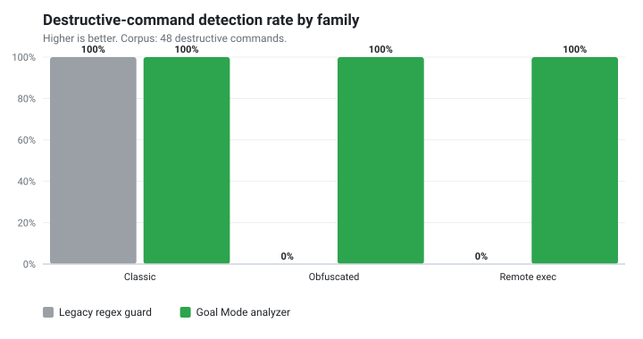
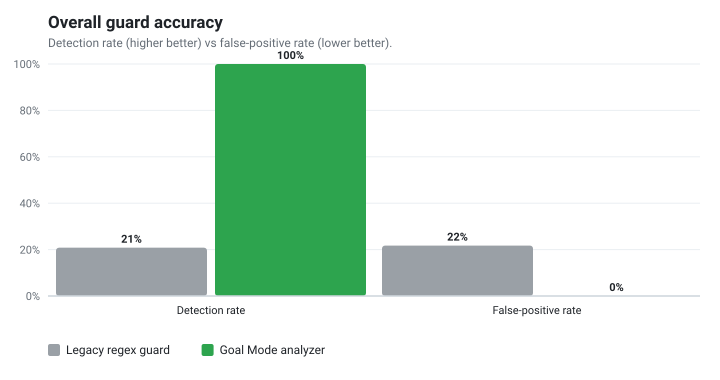

# OpenCode Goal Mode

Strict Goal Mode for OpenCode: a primary `goal` agent, a matrix of specialized
review subagents, slash commands, and a `goal-guard` plugin that enforces review
discipline, blocks destructive shell commands, and preserves goal state across
compaction **and** restarts.

See [ARCHITECTURE.md](ARCHITECTURE.md) for the design and [research/](research/)
for the platform reference, comparison, and threat model.

## Why it's different

Most "goal mode" / agentic setups are **prompt-only**: the model is *asked* to
review its work and to keep going until done. Goal Mode adds a guard plugin that
makes that discipline **mechanical at the harness layer** — the model cannot
declare `Goal Completed` until the required reviews actually passed, and it
cannot run a destructive command that a regex guard would miss.


Compared to Claude Code and OpenAI Codex (full analysis, with citations and
honest caveats, in [research/goal-mode-comparison.md](research/goal-mode-comparison.md)):

- **It is the only one of the three that mechanically blocks a premature
  completion claim by default.** Goal Mode intercepts the finished message and
  rewrites `Goal Completed` → `Goal Not Completed` unless every required reviewer
  gate has a *fresh* PASS and the claimed `Review cycles: N` matches the recorded
  counter. Claude Code can do this only via a user-authored Stop hook; Codex's
  code review is advisory.
- **An edit automatically invalidates prior approvals.** A reviewer gate counts
  only when its PASS is newer (by a monotonic integer sequence) than the last
  edit — so any change forces the relevant reviews to re-run. Neither Claude Code
  nor Codex ships this stale-review invariant.
- **Required specialist reviews are auto-selected and enforced** (security, api,
  data, performance …) from the goal text, contract, and changed files — not left
  to the model's discretion.
- **Destructive commands are blocked by a real shell tokenizer**, not a regex.
  Claude Code's own docs call Bash argument-matching *"fragile"*.

### Benchmark: shell-guard accuracy

The guard replaced a boundary-anchored regex classifier. On a labeled corpus of
71 real commands (`npm run bench`, reproducible — see
[research/benchmarks.md](research/benchmarks.md)):





| | Legacy regex guard | Goal Mode analyzer |
| --- | --- | --- |
| Destructive-command detection | **20.8%** | **100%** |
| False positives on safe commands | **21.7%** | **0%** |
| Obfuscated bypasses caught (`$(…)`, `bash -c`, `sudo -u`, interpreters) | 0% | 100% |
| Remote exec (`curl \| sh`) caught | 0% | 100% |

The deeper analysis costs ~0.6 µs more per command (~500,000 classifications/
second) — negligible for a per-tool-call guard:


## Requirements

- Node.js 20.11 or newer.
- OpenCode configured to load local agents, commands, and plugins.

## What it adds

- A primary `goal` agent that owns implementation but delegates research,
  discovery, verification planning, and reviews to subagents.
- Strict review gates for prompt compliance, diff review, verification, security,
  UX, operations, data, API, performance, tests, docs, quality, and final audit.
- Slash commands: `/goal`, `/goal-contract`, `/goal-review`, `/goal-status`,
  `/goal-repair`, `/goal-final`.
- The `goal-guard` plugin:
  - **Quote-aware shell analysis** that blocks destructive and remote-exec
    commands (including ones that evade naive regexes — `$(rm -rf …)`,
    `bash -c "…"`, `/bin/rm`, `git -C … reset --hard`, `curl | sh`) without
    false-positiving harmless commands like `git checkout -b`.
  - **Completion enforcement**: a premature `Goal Completed` is rewritten to
    `Goal Not Completed` with the exact missing review gates.
  - **Contextual gating**: the goal text and changed files determine which
    specialist reviewers are required.
  - **Disk persistence**: review ledgers survive OpenCode restarts.
  - **Custom tools**: `goal_contract`, `goal_evidence`, `goal_status`,
    `goal_reset`.
  - **Live state injection** into the system prompt so the model always knows
    what the guard requires.
- A test suite validating the analyzer, plugin hooks, state store, install
  safety, and config compatibility.

## Install globally

```bash
npm ci
npm run validate
npm run install:global
```

Restart OpenCode after installation. OpenCode loads agents, commands, and
plugins at startup.

## Install into one project

```bash
npm ci
npm run validate
npm run install:local
```

This writes to `./.opencode` in the current project.

## Installer options

```bash
node scripts/install.mjs --dry-run
node scripts/install.mjs --target /path/to/opencode-config
node scripts/install.mjs --global --force
node scripts/install.mjs --global --uninstall
```

The installer records a manifest of the files it writes. On upgrade it replaces
files it owns but refuses to clobber files you have locally modified unless
`--force` is passed. `--uninstall` removes only the files it installed and leaves
your local edits in place.

## Configuration

The guard works with zero configuration. To tune it, add options in
`opencode.json`:

```jsonc
{
  "plugin": [
    ["./plugins/goal-guard.js", { "blockDestructive": true, "contextualGates": true }]
  ]
}
```

Or via environment variables (`GOAL_GUARD_*`):

| Option / env | Default | Effect |
| --- | --- | --- |
| `blockDestructive` / `GOAL_GUARD_BLOCK_DESTRUCTIVE` | `true` | Block destructive bash before execution. |
| `blockNetworkExec` / `GOAL_GUARD_BLOCK_NETWORK_EXEC` | `true` | Block `curl \| sh`-style remote execution. |
| `enforceCompletion` / `GOAL_GUARD_ENFORCE_COMPLETION` | `true` | Rewrite premature `Goal Completed`. |
| `injectSystemState` / `GOAL_GUARD_INJECT_SYSTEM_STATE` | `true` | Inject live state into the prompt. |
| `persist` / `GOAL_GUARD_PERSIST` | `true` | Persist state under the XDG state dir. |
| `contextualGates` / `GOAL_GUARD_CONTEXTUAL_GATES` | `true` | Require specialist gates by goal keywords. |
| `maxSessions` / `GOAL_GUARD_MAX_SESSIONS` | `200` | Session cache size. |
| `sessionTtlMs` / `GOAL_GUARD_SESSION_TTL_MS` | `86400000` | Idle session TTL. |
| `toastOnBlock` / `GOAL_GUARD_TOAST_ON_BLOCK` | `true` | Toast when something is blocked. |

## Custom tools

The plugin registers four tools the model can call directly:

- `goal_contract` — record the Goal Contract (requirements, non-goals,
  acceptance criteria). Activates enforcement and fixes the required gates.
- `goal_evidence` — record a verification command and result.
- `goal_status` — return the authoritative gate/dirty/completion status.
- `goal_reset` — clear the session's goal state (requires `confirm: true`).

## Validation

```bash
npm test
npm run validate
npm run audit
npm run publish:check
```

`npm run validate` runs the test suite, the structural config validator, the
publish readiness check, and an `npm pack --dry-run`.

## Models

Agents do not pin a provider-specific model, so they inherit the model OpenCode
is configured to use. To give a particular agent a specific model, add a
`model:` (and optional `variant:`) line to that agent's frontmatter in your
installed copy.

## Safety

The installer copies only `agents/*.md`, `commands/*.md`, and the `plugins/`
tree — never auth files, session files, tokens, or personal provider config.

The guard blocks destructive shell commands, marks real file mutations dirty,
keeps read-only inspection from dirtying the session, preserves goal state during
compaction and across restarts, and blocks premature `Goal Completed` responses
when review gates are missing or stale.

## npm publishing

Install from npm after the first publish:

```bash
npm install -g opencode-goal-mode
opencode-goal-mode-install --global
```

Publishing is handled by `.github/workflows/publish.yml`, which runs on Node 24
with `id-token: write` for Trusted Publishing. The workflow validates the
package, checks the tag matches `package.json`, verifies the version is not
already on npm, then publishes. Manual workflow dispatch defaults to
`npm publish --dry-run`.

Release flow:

```bash
npm version patch
git push --follow-tags
```

Then create a GitHub Release from the pushed tag (e.g. `v0.1.1`). For
token-based publishing instead of Trusted Publishing, add a repository secret
`NPM_TOKEN` with publish rights.

## Goal Completion Contract

`Goal Completed` is allowed only when:

- All acceptance criteria are mapped to evidence.
- Required verification passed or is credibly accounted for.
- No edit is newer than the latest required review cycle.
- Required reviewers return `Verdict: PASS`.
- The final answer includes an accurate `Review cycles: N`.
